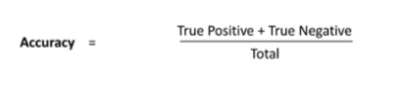

**Introduction**

An individual can encounter a stroke at any given minute. According to the CDC, for every 40 seconds an individual gets a stroke in the USA. An early measure for detecting any signs of stroke can minimize the risk of getting the stroke. There are many factors that play a role in determining if a person would encounter a stroke. Two of the main factors are: blocked arteries and leaking blood vessels.[1] There are numerous types of strokes. Some of which are:

1. Ischemic Stroke: most common stroke that individuals encounter. 
   1. Occurs when an individual’s brain blood vessel becomes smaller or blocked.
   1. Causes reduced flow of blood to the brain, due to fatty deposits being built up in the blood vessels.
1. Hemorrhagic Stroke: not as common as Ischemic but still severe. It occurs when blood vessels in a person’s brain ruptures. There are many complications that can affect the blood vessels, such as:
   1. Unstable, high blood pressure
   1. Bulges being developed at blood vessel walls with weak spots
   1. Trauma
   1. Deposits of protein in blood vessel
   1. Blood thinner overtreatment
   1. Ischemic stroke can potentially lead to hemorrhage 
1. Transient ischemic attack: also known as a ministroke. This is a state in which an individual faces the temporary effects of a normal stroke. 
   1. Occurs when a clot in a vessel reduces flow of blood to the nervous system.

These types of strokes have many risk factors that are associated with them. Some of which are lifestyle factors, medical risk factors, age, race, gender, hormones, etc. 

Fig. 1 - Example of a stroke occurrence in an individual’s brain. [1]

**Stroke Predictive Analysis**
**

The stroke predictive analysis application serves the purpose of collecting a user’s information and using previously collected data to compare and contrast, in order to make an accurate prediction of whether a user will encounter a stroke or not. The application takes in several values based on specific categories, such as:

1. Personal Information: User’s Age, User’s gender, Marriage status
1. Medical Information: Hypertension, Heart-disease, BMI, Average glucose level
1. Lifestyle Information: Work type, Residence type, Smoking status

All this information is collected from the user, when then is compared to past data collected from a dataset, which then allows us to predict if, based on the current user’s lifestyle, health, and medical conditions, if he or she will encounter a stroke in the future. 

`	`The application may be beneficial to patients, as well as doctors. Curious patients can use the application for themselves to predict their chances of encountering a stroke, whereas doctors can use this application to predict their patient’s status. With the results provided by the application, the user can then decide to make lifestyle changes in order to reduce their chances of getting a stroke. It can also serve as a motivation factor for the patient because each time they make lifestyle changes, they can update their result to calculate a new prediction which, if positive, will encourage them to keep that lifestyle pace to ensure they will have a stroke-free future. Below is a view of the application’s main screen.

Fig. 2 - Stroke Predictor Main screen

As one can see from Fig. 2, the application takes in numerous information from the user or patient, from ‘gender’ to ‘smoking history.’ Once inputted by the user, the data is then combined and compared with past collected data, to make an estimated prediction of how likely it is for the current user to encounter a stroke, based on their current lifestyle. 

The output of the results in an estimated percentage of the user’s stroke occurrence in the future. Our team inputted a few random values into our application and got some accurate results, as shown below, in Fig. 3 and Fig. 4.

Fig. 3 - User’s status with ‘positive’ status.		Fig. 4 - User’s status with ‘negative’ status.

As one can see from the two figures above, Fig. 3 illustrates a positive test result, whereas Fig. 4 illustrates a negative test result. Attributes such as, “age”, “heart disease,” “hypertension”, “average glucose level”, and “smoking history” play an immense role in deciding the percentage of the user’s probability of a stroke occurring, compared to the other attributes. The results clearly indicate this when we compare these attributes from the two figures.

- Fig. 3 Attributes
  - Age = 30
  - Heart Disease = 0
  - Hypertension = 0
  - Average Glucose Level = 100
  - Smoking History = ‘never smoked’
- Fig. 4 Attributes
  - Age = 40
  - Heart Disease = 1
  - Hypertension = 1
  - Average Glucose Level = 145
  - Smoking History = ‘never smoked’

Even though in Fig. 4, the person’s smoking history was marked as ‘never smoked,’ the other attributes of that individual outweighed the smoking history attribute. This resulted in the user from Fig. 3 having a 43% chance of encountering a stroke, whereas the individual in Fig. 4 has a 98% chance of encountering a stroke in the future, if certain lifestyle changes are not made in time.

**Methodology**

1. ***Data Description***

The data set is gathered from three sources:

1. Kaggle: Stroke Prediction Dataset (Size: 5110)
1. Kaggle: Heart Stroke (Size: 43400)
1. BigML: Stroke data (Size: 100k)

`	`Totally around 148k data records are used as input. 

`	`Links:  <https://www.kaggle.com/lirilkumaramal/heart-stroke> 

<https://www.kaggle.com/fedesoriano/stroke-prediction-dataset> <https://bigml.com/dashboard/dataset/5e92c6d14f6bfd2dd00044a9>

1. ***Tools Used***

Web UI: React JS Web Application

Database: Cassandra

Coding Languages: Python (Machine Learning Modeling), R (Visualization)

1. ***Machine Learning*** 

We use five machine learning algorithms for predictions. And the algorithms are: 

1. Logistic Regression
1. Random Forest
1. k-Nearest Neighbors
1. XGBoost
1. Artificial Neural Network (ANN)

We chose these algorithms because these classifiers are commonly used for classification problems. They are well suitable for building predictors and can be used in similar applications as well. 

1. ***Implementation***
   1. **Input Data:** In this step the data is merged from all the sources and loaded into the environment. 
   1. **Data preprocessing:** After the data is loaded, the data is processed to check for any missing values and duplicate values. Duplicate or redundant data is removed from the data set. Missing values are filled up with kNN imputation. Then hot-label encoding is performed to replace categorical values with numerical values, for example, in gender we will use 0 and 1 instead of Male and Female. Finally, for further processing a standard data set is obtained.
   1. **Visualization:** The distribution of data in relation to the stroke attribute is visualized for analysis and studying patterns. 
   1. **Split data:** The data is splitted into a train and test data set. 
   1. **Algorithms:** In this step, data is feeded to the algorithms to get the prediction result.
   1. **Best model:** In this step, the best algorithm with the most accuracy is chosen as the final model. 

**Project Architecture**

We used various components to build the architecture model for this project. Firstly, all the datasets are fed into the Cassandra database. All the other components are connected to the Cassandra database to access the data. We can perform data visualizations and machine learning modeling using the python and R languages. The application ReactJS is used to provide the web interface for the user to input the desired values and receive stroke predictions. 

Fig 5: Project Architecture Diagram

**Dataset Exploration / Visualization**

The machine learning models use the heart stroke databases to train and predict the probability of the user getting a stroke. Fig.6 shows the sample dataset used to build the model. The dataset has several null values, especially for the bmi and smoking status attributes. The age distribution was in the range 8 months to 80 years olds. The hypertension and heart disease attributes were imbalanced. Finally, the stroke label was heavily imbalanced with 42617 with no stroke and only 783 a stroke. Fig 7. shows the heatmap correlation of all the attributes. Depending on the graph, the age and ever\_married attributes seem to have the highest correlation compared to the other values.  

Fig 6: Sample rows of all dataset attributes

​​

Fig 7: Correlation Heatmap to observe the relationship between all the variables

**Modeling**

Among the various machine learning models available we have evaluated 5 models to pick the best one for stroke prediction through the web user interface. The below machine learning models are evaluated:

1. ***Logistic Regression***

Logistic Regression is a supervised learning that helps in binary classification separating discrete values. The model ran against the default parameters. Figures 8 and 9 show the model performance.

Fig 8: Evaluation Metrics for Logistic Regression

Fig 9: AUC-ROC Curve for Logistic Regression 

1. ***KNN***

`   `K Nearest Neighbor (KNN) finds the nearest neighbors/examples driven by “k” in the training data and chooses the label associated with them. The model gave best performance against the default parameters other than n\_neighbors=75 and metric=’manhattan’. Figures 10 and 11 show the model performance.

Fig 10: Evaluation Metrics for KNN

Fig 11: AUC-ROC Curve for KNN

1. ***Random Forest Classifier***

`  `Random forest consists of a large number of individual decision trees that operate as an ensemble. Each individual tree in the random forest spits out a class prediction and the class with the most votes becomes our model’s prediction. The best performance was drawn from default parameters other than the n\_estimators=100. Figures 12 and 13 show the model performance.

Fig 12: Evaluation Metrics for Random Forest

Fig 13: AUC-ROC Curve for Random Forest

1. ***XGBoost***

`  `XGBoost is a decision-tree-based ensemble Machine Learning algorithm that uses a gradient boosting framework. The model gave the best performance by using the following parameters: learning\_rate=0.1,objective='binary:logistic',random\_state=0,eval\_metric='mlogloss'. Figures 14 and 15 show the model performance.

`   `

Fig 14: Evaluation Metrics for XGBoost

Fig 15. AUC-ROC Curve for XGBoost

1. **Artificial Neural Network**

The Artificial Neural Network (ANN) is a series of algorithms that are trying to mimic the human brain and find the relationship between the sets of data. The model didn’t perform well in comparison to other ones and just achieved the best accuracy of 0.5. Below is the architecture of ANN that gave the best score.

`    `*model = Sequential()*

`    `*model.add(Dense(16, input\_dim=10, kernel\_initializer='normal', kernel\_regularizer=regularizers.l2(0.001), activation='relu'))*

`    `*model.add(Dropout(0.25))*

`    `*model.add(Dense(8, kernel\_initializer='normal', kernel\_regularizer=regularizers.l2(0.001), activation='relu'))*

`    `*model.add(Dropout(0.25))*

`    `*model.add(Dense(1, activation='softmax'))*

`    `*adam = Adam(lr=0.001)*

`    `*model.compile(loss='categorical\_crossentropy', optimizer='rmsprop', metrics=['accuracy'])*

**Performance Measures**

The following evaluation metrics have been used to measure the performance of the machine learning models.

1. ***Accuracy***

It is the ratio of number of correct predictions to the total number of the input samples

1. ***Precision***

It talks about how precise/accurate your model is out of those predicted positives, how many of them are actual positives.

1. ***Recall***

Recall calculates how many of the Actual Positives the model captures through labeling it as Positive (True Positive).

1. ***F-1***

It is the harmonic mean of recall and precision and used to seek a balance between precision and recall.

1. ***Sensitivity***

It evaluates a model’s ability to predict true positives of each available category

1. ***Specificity***

It is the metric that evaluates a model’s ability to predict true negatives of each available category

1. ***AUC-ROC Curve***

AUC - ROC curve is a performance measurement for the classification problems at various threshold settings. ROC is a probability curve and AUC represents the degree or measure of separability. It tells how much the model is capable of distinguishing between classes. Higher the AUC, the better the model is at predicting 0 classes as 0 and 1 classes as 1. By analogy, the Higher the AUC, the better the model is at distinguishing between patients with the disease and no disease.

The figure 16 and 17 reflects the overall comparison of different machine learning models across various evaluation metrics.

`				`Fig 16: Performance benchmark

Fig 17: Performance benchmark
**

**Conclusion**

Based on the initial data analysis and after preprocessing of data the following conclusions were drawn:

1. Smoking increases the probability of having a stroke in the individual.
1. But smoking alone cannot be considered as a driving factor. There are other features including age, BMI, and glucose level that are important in determining the stroke probability.
1. Women are prone to stroke on average at a much older age (74-79) in comparison to males which experience strokes on average as soon as their mid 50's and 60’s.
1. Through the web user interface capability can be introduced for both the patients and clinicians to correct the prediction or input historical data that could be fed back into the models for retraining.

**References**

[1] “Stroke,” *Mayo Clinic*, 09-Feb-2021. [Online]. Available: https://www.mayoclinic.org/diseases-conditions/stroke/symptoms-causes/syc-20350113. [Accessed: 03-Dec-2021]. 

